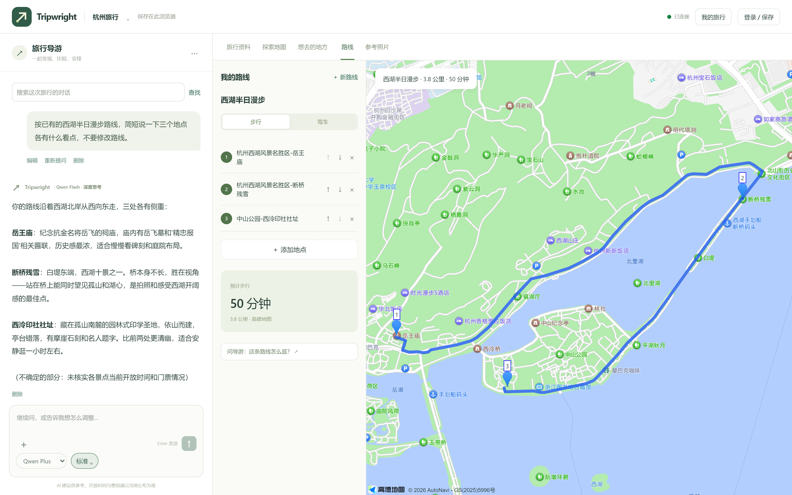
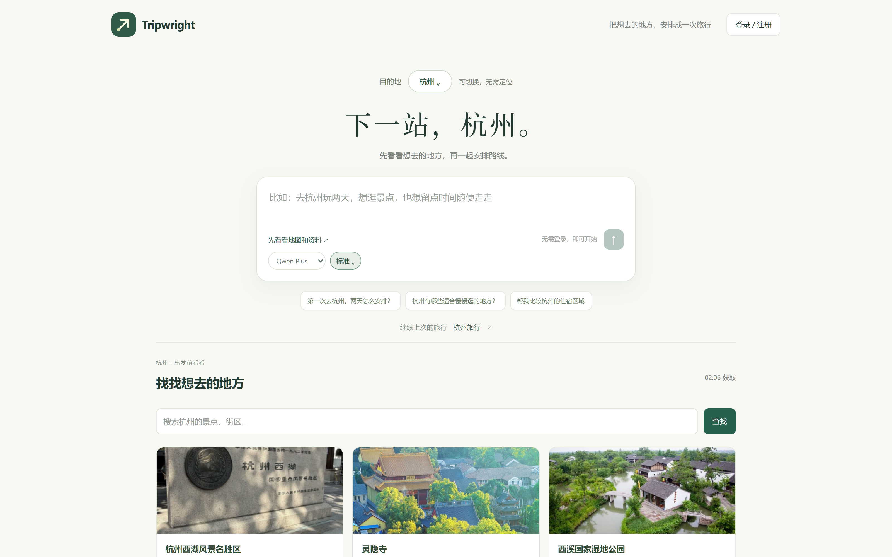

<p align="center">
  
</p>

<p align="center">
  <a href="https://guide.dirtydev.cc">Live demo</a> ·
  <a href="docs/DEPLOYMENT.md">Deployment</a> ·
  <a href="docs/ARCHITECTURE.md">Architecture</a> ·
  <a href="README.md">简体中文</a>
</p>

# AI-Guide

A self-hosted travel planning agent for desktop browsers. Discuss places in the conversation, add them to a route, and compare walking and driving directions on the map. Conversations, saved places and routes stay together in each trip.

The current interface and documentation are primarily in Chinese. Place search and directions use AMap and are intended mainly for destinations in China.

[](docs/assets/readme/routes.webp)

## Try it

Visit the [public demo](https://guide.dirtydev.cc). Select a city and start exploring without logging in, granting location access or uploading a photo.

The demo has usage limits. Use sample trips and avoid uploading sensitive information. Registration and login are available, but the demo does not currently deliver verification or password reset emails.

## Features

- Choose a destination and browse places with photos and addresses. Save a place, add it to a route, or ask the guide about it.
- Keep conversations alongside travel resources and maps. Search messages, edit questions, delete messages or ask again; affected older answers are marked after edits.
- Search and add stops directly in a route, change their order, and compare walking and driving directions. Stops survive a failed route calculation.
- Start as a guest and save the trip to an account later. Keep separate trips and reopen them after signing in.
- Optionally upload a reference photo, confirm the recognized place, and request a guide card.
- Open curated travel links and Bilibili search links. The application does not crawl arbitrary guide articles or analyze videos.

[](docs/assets/readme/home.webp)

## Self-hosting

Use Docker Engine and Compose v2. You need a domain pointing at your server, a working Qwen-compatible model endpoint, AMap Web Service credentials and a separate AMap JavaScript key. Email verification and password recovery require SMTP.

Clone the repository:

```bash
git clone https://github.com/DirtyDidsDoneDerCheap2049/AI_Guide.git
cd AI_Guide
```

From the repository root, create `.env` only if it does not already exist:

```bash
cp -n deploy/.env.production.example .env
chmod 600 .env
nano .env
```

Set database credentials, an independent session secret, model and AMap settings, `SITE_ADDRESS` and `PUBLIC_BASE_URL`. Keep `IMAGE_REGISTRY=local` to build from source. Follow the [configuration guide](docs/DEPLOYMENT.md) before starting.

```bash
docker compose -f docker-compose.yml -f deploy/compose.small.yml config --quiet
docker compose -f docker-compose.yml -f deploy/compose.small.yml pull mysql redis
docker compose -f docker-compose.yml -f deploy/compose.small.yml build api
docker compose -f docker-compose.yml -f deploy/compose.small.yml build web
docker compose -f docker-compose.yml -f deploy/compose.small.yml up -d
```

The small profile uses one Worker process with two threads. Builds run separately to reduce concurrent memory demand. The migration container should exit with code 0 before the API starts. Caddy serves the frontend and obtains an HTTPS certificate.

A deployment on Ubuntu 24.04 with 2 GB RAM has completed image builds, migrations and HTTPS setup. Its initial idle container memory total was about 675 MiB. This is a single snapshot, not a concurrency benchmark or a peak memory estimate.

## Engineering

Vue 3 and TypeScript provide the UI. FastAPI validates requests, ownership and versions. MySQL stores trips, messages, routes, task states and events; Redis provides the task queue and short-lived caching. Dramatiq Workers execute model tasks with bounded retries, leases and recovery. SSE delivers persisted events with a reconnect cursor.

See [architecture](docs/ARCHITECTURE.md) and [local development](docs/DEMO-STARTUP.md) for code entry points and checks.

## Scope

Travel advice needs source verification, especially prices, opening hours and booking rules. Models use an OpenAI-compatible chat API with Qwen-specific thinking parameters and JSON output requirements; other providers need compatibility testing. The current version does not include booking, payments, turn-by-turn navigation, a separate mobile app or a deep-thinking switch.

Automated fixtures test system behavior. Real provider quality and production backup recovery require separate validation. The public demo's email delivery remains unconfigured.

## License

Source code is licensed under [MIT](LICENSE). Maps, place photos and third-party marks shown in screenshots retain their respective ownership; see [image notes](docs/assets/readme/README.md). Do not include credentials or personal data in issues; see [security](SECURITY.md).
