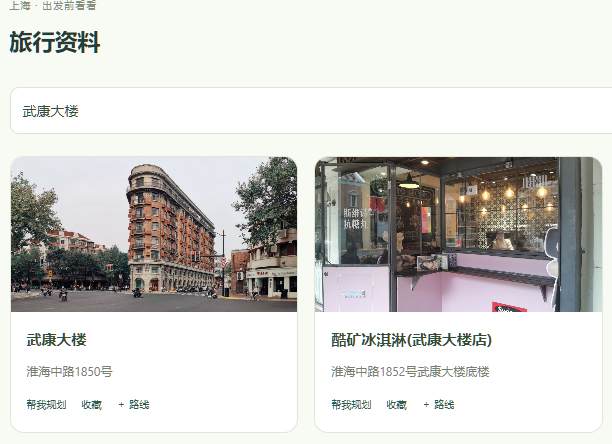
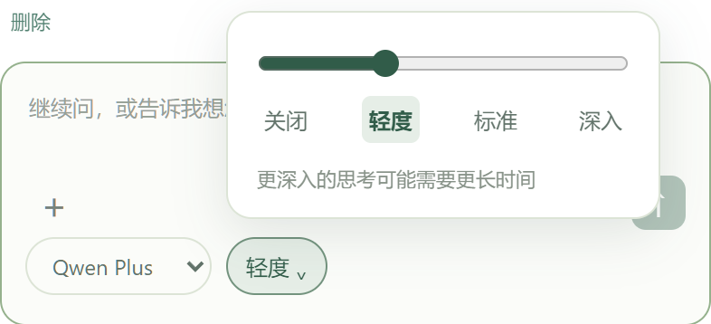
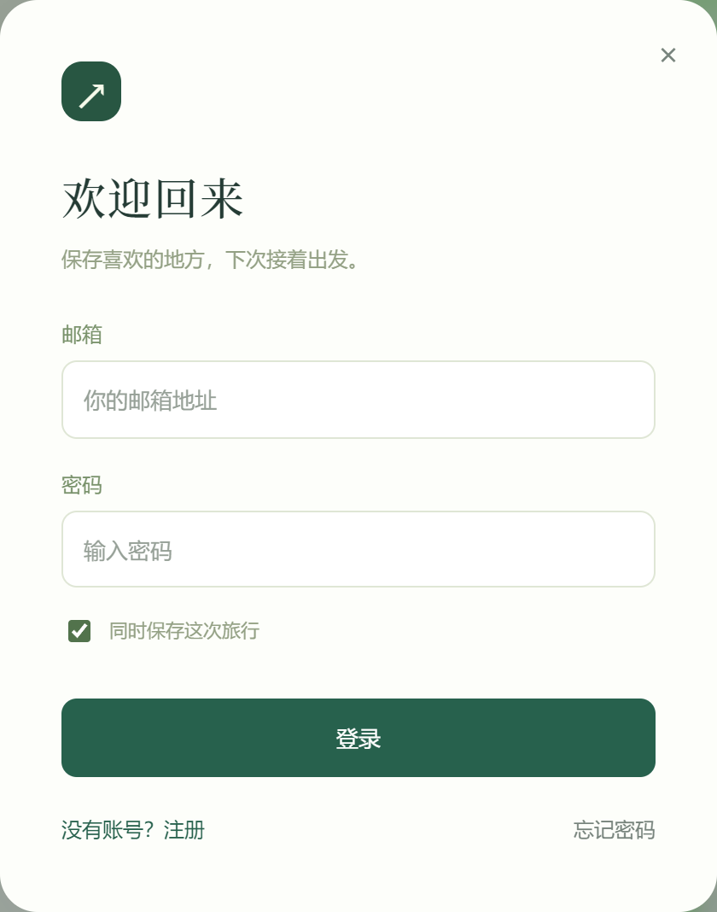
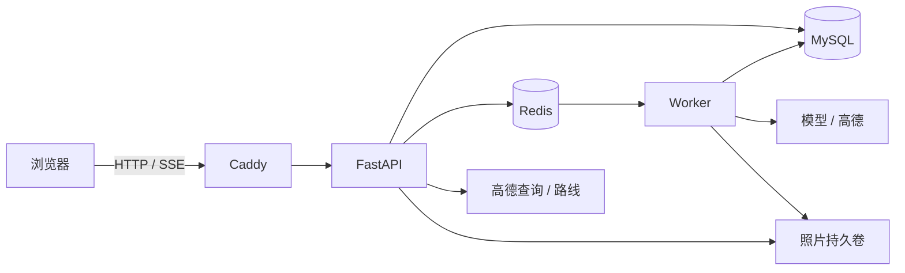

<p align="center">
  
</p>

<p align="center">
  <a href="https://guide.dirtydev.cc">在线体验</a> ·
  <a href="#自己部署">自己部署</a> ·
  <a href="docs/ARCHITECTURE.md">后端设计</a> ·
  <a href="README.en.md">English</a>
</p>

<p align="center">
  
  
  
  
</p>

Tripwright 是一个可以自己部署的桌面旅行规划 Agent。选一座城市，边聊边找地点，把想去的地方加进路线，在地图上比较步行和驾车方案。对话、收藏和路线保存在同一次旅行里，下次打开可以接着安排。

[](docs/assets/readme/routes.webp)

## 先试一试

打开 [在线 Demo](https://guide.dirtydev.cc)，选好城市就能开始。无需先登录、授权定位或上传照片；也可以先看地图和旅行资料，再决定问什么。

公共 Demo 有调用额度，适合短时间体验。请使用示例旅行，不要上传敏感照片或提交私人信息。注册和登录已提供；演示站目前尚未配置真实邮件投递，邮箱验证和密码找回暂不可用。

## 用它安排旅行

### 从一座城市开始

选择推荐城市或输入目的地，浏览景点、街区和住宿相关地点。地点卡片带图片和地址，可以收藏、加入路线，也可以带着这个地点继续问导游。

[](docs/assets/readme/home.webp)

### 边看资料，边讨论

旅行资料、对话和地图放在同一个工作区。Agent 会结合这次旅行已有的地点和路线回答问题，并按需要搜索地点、创建或调整路线。问过的内容可以搜索，自己的提问可以编辑、删除或重新发送；编辑后会标记受影响的旧回答。

<p align="center">
  
</p>

### 路线随时改

在路线面板直接搜索并添加地点，调整停留点顺序，或移除不想去的地方。切换步行和驾车，查看高德返回的线路、距离与预计时长。计算失败会保留地点列表，并提示重新计算。

### 选择模型和思考模式

在输入框下方选择已配置的模型，点击档位按钮，用滑条在“关闭、轻度、标准、深入”之间调整。选项随模型能力变化。每条任务记录发送时的选择，切换模型不会改变正在生成的回答。支持 OpenAI Chat Completions 兼容接口，供应商密钥保留在服务器。配置方式见 [模型与深度思考](docs/MODELS.md)。

<p align="center">
  
</p>

### 下次接着计划

可以先以访客身份试用，再把旅行保存到自己的账号。多次旅行分别保存，刷新和再次登录后继续查看。已有景点照片也可以作为线索上传，确认识别地点后获取讲解；照片是可选的辅助入口。

<p align="center">
  
</p>

## 自己部署

推荐 Docker Compose，从源码构建前后端。一台服务器同时运行 Web、API、Worker、MySQL 和 Redis，Caddy 负责 HTTPS。

需要准备 Docker Engine 与 Compose v2、一个解析到服务器的域名、可用的 OpenAI Chat Completions 兼容模型接口，以及高德 Web 服务 Key 和 Web 端 JS Key。真实邮箱验证与找回密码还需要 SMTP。

先克隆仓库，再进入项目目录：

```bash
git clone https://github.com/DirtyDidsDoneDerCheap2049/AI_Guide.git
cd AI_Guide
```

在仓库根目录执行以下 Linux 命令。已有 `.env` 时直接编辑，不要覆盖：

```bash
cp -n deploy/.env.production.example .env
chmod 600 .env
nano .env
```

填好数据库密码、随机会话密钥、模型与高德配置，并设置 `SITE_ADDRESS` 和 `PUBLIC_BASE_URL`。具体变量和高德配置见 [部署指南](docs/DEPLOYMENT.md)。保留 `IMAGE_REGISTRY=local` 即可从源码构建，不需要先有镜像仓库。

```bash
# 2GB 机器使用小内存配置；分开构建，降低同时编译的内存占用。
docker compose -f docker-compose.yml -f deploy/compose.small.yml config --quiet
docker compose -f docker-compose.yml -f deploy/compose.small.yml pull mysql redis
docker compose -f docker-compose.yml -f deploy/compose.small.yml build api
docker compose -f docker-compose.yml -f deploy/compose.small.yml build web
docker compose -f docker-compose.yml -f deploy/compose.small.yml up -d
docker compose -f docker-compose.yml -f deploy/compose.small.yml ps -a
```

迁移容器 `migrate` 正常完成时显示 `Exited (0)`。API 就绪后，Caddy 自动申请 HTTPS 证书，浏览器打开配置的域名即可。

已在 Ubuntu 24.04、2GB 内存的单机上完成镜像构建、迁移和 HTTPS 部署。首次启动空闲快照中，五个容器合计约 675 MiB；这不是并发容量或峰值内存承诺。新增访问量、上传和构建任务都需要重新观察资源占用。

本地开发、fixture 模式和独立测试库配置见 [开发指南](docs/DEMO-STARTUP.md)。

从原 AI-Guide 版本更新，见 [GitHub 与服务器更新步骤](docs/UPDATE-TRIPWRIGHT.md)。项目显示名称已改为 Tripwright，现有仓库地址和部署数据标识保留，已有旅行可继续使用。

## 后端怎么工作

| 部分 | 技术与职责 |
|---|---|
| 网页 | Vue 3、TypeScript、Vite；城市入口、对话、资料、地图和路线 |
| API | FastAPI、Pydantic；输入校验、归属校验、版本冲突与任务创建 |
| 数据库 | MySQL、SQLAlchemy、Alembic；旅行、消息、路线、运行状态与事件 |
| 后台任务 | Dramatiq Worker；模型调用、步骤推进、租约和超时恢复 |
| 队列与缓存 | Redis；任务投递、短期缓存和部分限流 |
| 页面进度 | SSE；通过持久事件和游标补发断线期间的更新 |
| 外部服务 | OpenAI Chat Completions 兼容接口、高德地点检索与算路、JS 地图安全代理 |
| 部署 | Docker Compose、Caddy、持久化数据卷 |



模型任务由 Worker 执行，旅行状态保存在 MySQL。消息与路线修改使用版本号，重复上传使用幂等键；任务有有限重试、取消、租约与费用预算。模型能执行的路线操作经过结构校验和业务边界检查。

实现细节、失败路径和代码入口见 [架构说明](docs/ARCHITECTURE.md)。

## 当前边界

- 主要适用于电脑浏览器和国内城市规划。高德提供地点、图片和路线；模型建议不等同于已核实的营业时间、票价或预约规则。
- 攻略和 B 站视频目前来自已收录链接与搜索入口，不解析全网攻略正文或视频内容。
- 模型通过 OpenAI Chat Completions 兼容协议调用，思考参数按模型配置适配；只接受服务端白名单内的模型。更换供应商仍需验证参数、结构化输出和图片能力。
- 邮箱验证和密码找回依赖真实 SMTP；`console` 仅用于开发，不投递邮件。
- 当前没有订票、支付、实时导航或独立手机 App。
- 自动回归使用 fixture 验证流程；真实模型质量与外部服务连通性要单独验收。部署与操作结果不代表已经做过并发压测或生产恢复演练。

## 许可证

源码使用 [MIT License](LICENSE)。界面截图中的地图、地点照片和第三方标识保留原权利归属，见 [图片来源说明](docs/assets/readme/README.md)。
