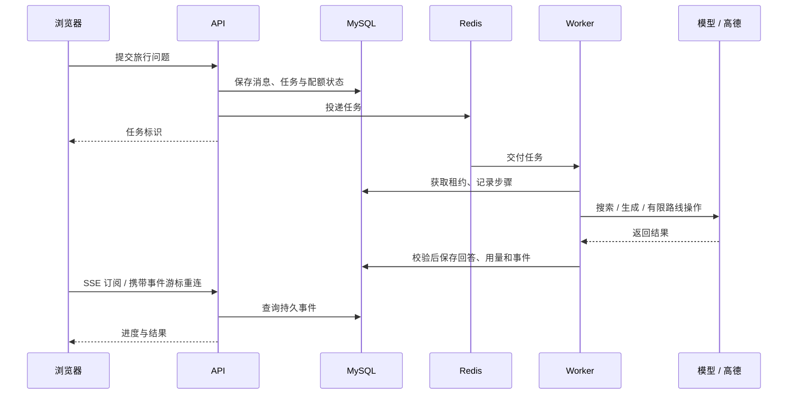
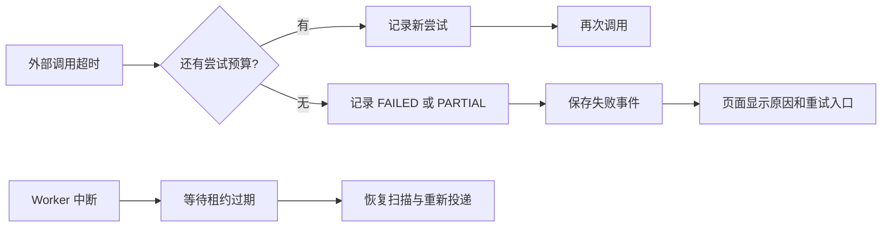

# 后端设计

AI-Guide 使用一个 API 服务和一个独立 Worker，共用 MySQL 业务模型。Redis 承载队列及短期缓存，Caddy 提供静态页面、同源反向代理和 HTTPS。当前是单机部署。

## 模块入口

| 模块 | 代码 | 职责 |
|---|---|---|
| HTTP API | [api](../backend/app/api/) | 请求校验、身份与归属检查、错误语义、快照与 SSE |
| 业务服务 | [services](../backend/app/services/) | 账号、资料、地点、路线、媒体与任务创建 |
| Agent | [agent](../backend/app/agent/) | 受控流程、结构化输出校验、工具边界、预算与恢复 |
| Provider | [providers](../backend/app/agent/providers/) | 模型、高德与 fixture 实现；超时、HTTP 错误、无结果分类 |
| Worker | [worker](../backend/app/worker/) | Dramatiq 入口、任务执行与周期恢复 |
| 模型与迁移 | [models.py](../backend/app/models.py)、[migrations](../backend/migrations/) | 持久实体与 Alembic 迁移链 |
| 浏览器状态 | [composables](../web/src/composables/)、[events.ts](../web/src/api/events.ts) | 旅行快照、账号、路线、事件续订 |

## 数据与执行

旅行关联消息、参考照片、已保存地点和路线草稿。运行与步骤记录状态、重试、用量和租约；事件按旅行记录递增序号，浏览器用快照和后续事件对齐页面。

MySQL 保存业务事实。浏览器 Cookie 标识访客/账号会话，授权以服务器归属关系为准。消息和路线更新携带版本号，旧版本写入返回冲突。删除消息保留软删除状态，不连带删除路线。

模型调用在 Worker 中执行。用户直接搜索地点、发现资料和计算路线时，API 也会调用高德，不能将所有外部调用理解为后台任务。媒体存在持久卷，访问先检查旅行归属。

文字 Agent 由后端控制流程，并允许有限的地点搜索和路线动作。它不是能执行任意代码或工具的通用代理。文本模型负责问答和导游内容，图片模型抽取候选地点；图片确认流程需要用户参与。

## 正常流程

数据库和 Redis 之间没有分布式事务。排队任务、租约和恢复扫描用于补偿投递中断；执行以持久状态判断是否仍有权写入，不把队列重投等同于可无限重复调用供应商。

## 失败与恢复

Provider 将超时、限流、HTTP 错误、非 JSON 返回和无结果分开处理。重试次数、工具调用数、token 和估算费用有上限。模型返回先解析、校验，再落到业务操作；JSON 修复也有限次。

照片任务包含 `WAITING_USER`；文字任务不要求上传照片。终态包括 `SUCCEEDED`、`PARTIAL`、`FAILED`、`CANCELLED`。具体步骤的失败可能终止任务或保留部分结果，参见 [orchestrator.py](../backend/app/agent/orchestrator.py) 和 [recovery.py](../backend/app/agent/recovery.py)。

路线计算失败保留停留点，旧路线结果不能继续被当作当前方案。SSE 断开只表示连接中断，页面不能据此判定任务失败。

## 验证与限制

集成测试使用真实 MySQL/Redis 和 fixture Provider；供应商 HTTP 协议测试使用本地桩。部署流水线构建镜像并运行任务成功与失败路径，不使用维护者真实密钥。

真实模型、地图来源和内容质量需要另行验证。`/api/health/ready` 检查 MySQL、迁移与 Redis，不验证供应商额度、SMTP 或 Worker 吞吐。当前没有多实例负载、供应商准确率或长期可用性指标。

默认配置支持单机演示；多副本 Worker、数据库连接池扩容、队列积压治理、代理信任和恢复时间目标都要在有实际负载后测量。下一步优先完善真实邮件投递、生产恢复演练和模型对比样例。
